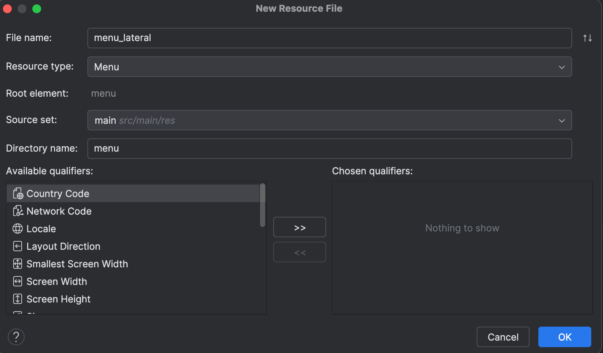

# Menú lateral

Creamos un proyecto desde cero y ponemos en build.gradle.kts el paquete que permite manejar binding.

```xml
buildFeatures {
        viewBinding = true
    }
```

Sincronizamos.

En la activity_main.xml remplazamos el código por esto:

```xml
<androidx.drawerlayout.widget.DrawerLayout
    xmlns:android="http://schemas.android.com/apk/res/android"
    xmlns:app="http://schemas.android.com/apk/res-auto"
    android:id="@+id/drawer_layout"
    android:layout_width="match_parent"
    android:layout_height="match_parent">

    <!-- Contenido principal de la actividad -->
    <LinearLayout
        android:layout_width="match_parent"
        android:layout_height="match_parent"
        android:orientation="vertical">

        <!-- Toolbar -->

        <com.google.android.material.appbar.MaterialToolbar
            android:id="@+id/toolbar"
            android:layout_width="match_parent"
            android:layout_height="?attr/actionBarSize"
            android:background="?attr/colorPrimary"
            android:title="Mi menú lateral"
            app:popupTheme="@style/ThemeOverlay.AppCompat.Light"/>

        <!-- Aquí va el contenido principal (usualmente un FrameLayout) -->
    </LinearLayout>

    <!-- NavigationView para el menú lateral -->
    <com.google.android.material.navigation.NavigationView
        android:id="@+id/navigation_view"
        android:layout_width="wrap_content"
        android:layout_height="match_parent"
        android:layout_gravity="start"
        app:menu="@menu/menu_lateral" />

</androidx.drawerlayout.widget.DrawerLayout>
```

Esto habilita el menú lateral y la ToolBar que vimos en capítulos anteriores.

Creamos el menú como ya hemos hecho en otras ocasiones:



Con los valores, por ejemplo:

```xml
<?xml version="1.0" encoding="utf-8"?>
<menu xmlns:android="http://schemas.android.com/apk/res/android">
    <item android:id="@+id/navigation_opcion1"
        android:title="Opción 1"
        android:icon="@drawable/ic_menu_opcion_1" />
    <item android:id="@+id/navigation_opcion2"
        android:title="Opción 2"
        android:icon="@drawable/ic_menu_opcion_2" />
    <item android:id="@+id/navigation_opcion3"
        android:title="Opción 3"
        android:icon="@drawable/ic_menu_opcion_3" />
</menu>
```

No olvides crear esas imágenes usando `new/Vector Asset`.

Volvemos al diseño de activity_main.xml y arrastramos un NavHostFragment a la activity. Será el contenedor donde cargaremos los fragmentos según la opción elegida en el menú lateral. Por ahora no haremos nada con él por lo que lo comentaremos para ver si funciona la carga inicial.

Quedará así el código de activity_xml:

```xml
<androidx.drawerlayout.widget.DrawerLayout
    xmlns:android="http://schemas.android.com/apk/res/android"
    xmlns:app="http://schemas.android.com/apk/res-auto"
    android:id="@+id/drawer_layout"
    android:layout_width="match_parent"
    app:popupTheme="@style/ThemeOverlay.AppCompat.Light"
    app:theme="@style/ThemeOverlay.AppCompat.Dark.ActionBar"
    android:layout_height="match_parent">

    <!-- Contenido principal de la actividad -->
    <LinearLayout
        android:layout_width="match_parent"
        android:layout_height="match_parent"
        android:orientation="vertical">

        <!-- Toolbar -->

        <com.google.android.material.appbar.MaterialToolbar

            android:id="@+id/toolbar"
            android:layout_width="match_parent"
            android:layout_height="?attr/actionBarSize"
            android:layout_marginTop="20dp"
            android:background="?attr/colorPrimary"
            android:title="Mi menú lateral"
            app:theme="@style/ThemeOverlay.AppCompat.Dark.ActionBar"
            app:popupTheme="@style/ThemeOverlay.AppCompat.Light"/>

        <!-- Aquí va el contenido principal según la opción elegida (usualmente un FrameLayout) -->
        
<!--        <androidx.fragment.app.FragmentContainerView-->
<!--            android:id="@+id/fragmentContainerView"-->
<!--            android:name="androidx.navigation.fragment.NavHostFragment"-->
<!--            android:layout_width="match_parent"-->
<!--            android:layout_height="match_parent"-->
<!--            app:defaultNavHost="true"-->
<!--            app:navGraph="@navigation/mi_nav" />-->

        
    </LinearLayout>

    <!-- NavigationView para el menú lateral -->
    <com.google.android.material.navigation.NavigationView
        android:id="@+id/navigation_view"
        android:layout_width="wrap_content"
        android:layout_height="match_parent"
        android:layout_gravity="start"
        app:menu="@menu/menu_lateral" />

</androidx.drawerlayout.widget.DrawerLayout>
```

Y en el código de la app, en MainActivity.kt pondremos:

```kotlin
package com.example.menulateral

import android.os.Bundle
import android.view.MenuItem
import androidx.activity.enableEdgeToEdge
import androidx.appcompat.app.ActionBarDrawerToggle
import androidx.appcompat.app.AppCompatActivity
import androidx.core.view.GravityCompat
import androidx.core.view.ViewCompat
import androidx.core.view.WindowInsetsCompat
import androidx.drawerlayout.widget.DrawerLayout
import androidx.navigation.ui.AppBarConfiguration
import com.example.menulateral.databinding.ActivityMainBinding

class MainActivity : AppCompatActivity() {
    private lateinit var binding: ActivityMainBinding
    private lateinit var appBarConfiguration: AppBarConfiguration
    private lateinit var toggle: ActionBarDrawerToggle

    override fun onCreate(savedInstanceState: Bundle?) {
        super.onCreate(savedInstanceState)
        enableEdgeToEdge()
        binding = ActivityMainBinding.inflate(layoutInflater)
        setContentView(binding.root)

        //Configura el Toolbar
        setSupportActionBar(binding.toolbar)

        //Inicializa DrawerLayout
        val drawerLayout: DrawerLayout = binding.drawerLayout

        //Habilita el botón de hamburguesa para abrir el drawer
        supportActionBar?.setDisplayHomeAsUpEnabled(true)
        supportActionBar?.setHomeAsUpIndicator(R.drawable.ic_menu)

    }

    //Método para abrir el drawer al presionar el ícono de menú
    override fun onOptionsItemSelected(item: MenuItem): Boolean {
        return when (item.itemId) {
            android.R.id.home -> {
                val drawerLayout: DrawerLayout = binding.drawerLayout
                drawerLayout.openDrawer(GravityCompat.START)
                true
            }
            else -> super.onOptionsItemSelected(item)
        }
    }
}
```

La imagen `ic_menu` la creamos con ***Vector_Asset***.

Si lanzamos la app tenemos algo así:


Actualmente las opciones de menú no hacen nada.

Vamos a añadir los fragmentos que se lanzarán en el contenedor según la opción elegida. Elegimos new/Fragment/Fragment with viewmodel.

Con los siguientes nombres:


En el xml de los fragmentos pondremos algo así para distinguirlos (cambia el color y el texto para cada uno):

```xml
<?xml version="1.0" encoding="utf-8"?>
<FrameLayout xmlns:android="http://schemas.android.com/apk/res/android"
    xmlns:tools="http://schemas.android.com/tools"
    android:layout_width="match_parent"
    android:background="#D8DEA6"
    android:layout_height="match_parent"
    tools:context=".FragmentoA">

    <TextView
        android:layout_width="match_parent"
        android:layout_height="match_parent"
        android:text="Soy el fragmento A" />

</FrameLayout>
```

Añadimos un Navigation desde Android Resource File:


El archivo mi_nav.xml quedará así:

```xml
<?xml version="1.0" encoding="utf-8"?>
<navigation xmlns:android="http://schemas.android.com/apk/res/android"
    xmlns:app="http://schemas.android.com/apk/res-auto"
    xmlns:tools="http://schemas.android.com/tools"
    android:id="@+id/mi_nav"
    app:startDestination="@id/navigation_opcion1">

    <fragment
        android:id="@+id/navigation_opcion1"
        android:name="com.example.menulateral.FragmentoA"
        android:label="fragment_fragmento_a"
        tools:layout="@layout/fragment_fragmento_a" />
    <fragment
        android:id="@+id/navigation_opcion2"
        android:name="com.example.menulateral.FragmentoB"
        android:label="fragment_fragmento_b"
        tools:layout="@layout/fragment_fragmento_b" />
    <fragment
        android:id="@+id/navigation_opcion3"
        android:name="com.example.menulateral.FragmentoC"
        android:label="fragment_fragmento_c"
        tools:layout="@layout/fragment_fragmento_c" />
</navigation>
```

**Observa que los id’s son iguales que los id’s de los menús asociados. Esto es importante porque si no es así, no funcionará.**

El main_layout.xml de la pantalla principal quedará así, descomentando el contenedor de navegación:

```xml
<androidx.drawerlayout.widget.DrawerLayout
    xmlns:android="http://schemas.android.com/apk/res/android"
    xmlns:app="http://schemas.android.com/apk/res-auto"
    android:id="@+id/drawer_layout"
    android:layout_width="match_parent"
    app:popupTheme="@style/ThemeOverlay.AppCompat.Light"
    app:theme="@style/ThemeOverlay.AppCompat.Dark.ActionBar"
    android:layout_height="match_parent">

    <!-- Contenido principal de la actividad -->
    <LinearLayout
        android:layout_width="match_parent"
        android:layout_height="match_parent"
        android:orientation="vertical">

        <!-- Toolbar -->

        <com.google.android.material.appbar.MaterialToolbar

            android:id="@+id/toolbar"
            android:layout_width="match_parent"
            android:layout_height="?attr/actionBarSize"
            android:layout_marginTop="20dp"
            android:background="?attr/colorPrimary"
            android:title="Mi menú lateral"
            app:theme="@style/ThemeOverlay.AppCompat.Dark.ActionBar"
            app:popupTheme="@style/ThemeOverlay.AppCompat.Light"/>

        <!-- Aquí va el contenido principal según la opción elegida (usualmente un FrameLayout) -->

        <androidx.fragment.app.FragmentContainerView
            android:id="@+id/fragmentContainer"
            android:name="androidx.navigation.fragment.NavHostFragment"
            android:layout_width="match_parent"
            android:layout_height="match_parent"
            app:defaultNavHost="true"
            app:navGraph="@navigation/mi_nav" />

    </LinearLayout>

    <!-- NavigationView para el menú lateral -->
    <com.google.android.material.navigation.NavigationView
        android:id="@+id/navigation_view"
        android:layout_width="wrap_content"
        android:layout_height="match_parent"
        android:layout_gravity="start"
        app:menu="@menu/menu_lateral" />

</androidx.drawerlayout.widget.DrawerLayout>
```

Configura el Toolbar y Drawer en MainActivity de la siguiente manera:

```kotlin
package com.example.menulateral

import android.os.Bundle
import android.view.MenuItem
import androidx.activity.enableEdgeToEdge
import androidx.appcompat.app.ActionBarDrawerToggle
import androidx.appcompat.app.AppCompatActivity
import androidx.core.view.GravityCompat
import androidx.core.view.ViewCompat
import androidx.core.view.WindowInsetsCompat
import androidx.drawerlayout.widget.DrawerLayout
import androidx.navigation.NavController
import androidx.navigation.fragment.NavHostFragment
import androidx.navigation.ui.AppBarConfiguration
import androidx.navigation.ui.navigateUp
import androidx.navigation.ui.setupActionBarWithNavController
import com.example.menulateral.databinding.ActivityMainBinding
import com.google.android.material.navigation.NavigationView

class MainActivity : AppCompatActivity() {
    private lateinit var binding: ActivityMainBinding
    private lateinit var appBarConfiguration: AppBarConfiguration
    private lateinit var toggle: ActionBarDrawerToggle
    private lateinit var navController: NavController


    override fun onCreate(savedInstanceState: Bundle?) {
        super.onCreate(savedInstanceState)
        enableEdgeToEdge()
        binding = ActivityMainBinding.inflate(layoutInflater)
        setContentView(binding.root)


        //Configura el Toolbar
        setSupportActionBar(binding.toolbar)

        //Inicializa DrawerLayout
        val drawerLayout: DrawerLayout = binding.drawerLayout

        //Habilita el botón de hamburguesa para abrir el drawer de forma manual, si quiero personalizarlo.
//        supportActionBar?.setDisplayHomeAsUpEnabled(true)
//        supportActionBar?.setHomeAsUpIndicator(R.drawable.ic_menu)

        //******************* Para iniciar el navController que me permitirá navegar de un fragmento a otro.
        val navHostFragment = supportFragmentManager.findFragmentById(R.id.fragmentContainer) as NavHostFragment
        navController = navHostFragment.navController
        //En el archivo mi_nav.xml los id de los fragmentos en el nav_graph debe coincidir con los id de los elementos en mi_menu.xml.
        //Es decir para que funcione esto de arriba los fragmentos se llamarán:
        // -- en mi_nav: navigation_fragmento_a
        // -- en menu: navigation_fragmento_a


        //Define los destinos principales para que siempre muestre el ícono de hamburguesa en lugar de la flecha de retroceso
        //Configura AppBarConfiguration con tus destinos principales.
        appBarConfiguration = AppBarConfiguration(
            setOf(R.id.navigation_opcion1, R.id.navigation_opcion2, R.id.navigation_opcion3),
            drawerLayout
        )
        //appBarConfiguration = AppBarConfiguration(navController.graph, drawerLayout) //--> De esta manera solo se mostraría el ícono de hamburguesa en el Fragmento 1 (principal) y retroceso en el resto.

        //Configura AppBarConfiguration para sincronizar el botón de hamburguesa.
        //Vincula el NavController con el ActionBar
        setupActionBarWithNavController(navController, appBarConfiguration)

        //Como se carga el primer elemento, ponemos el título del primer fragmento.
        supportActionBar?.title = "Opción 1"

        //Configura NavigationView
        val navView: NavigationView = binding.navigationView
        navView.setNavigationItemSelectedListener { menuItem ->
            //Maneja las selecciones del menú aquí
            when (menuItem.itemId) {
                R.id.navigation_opcion1 -> {
                    navController.navigate(R.id.navigation_opcion1)
                    supportActionBar?.title = "Opción 1"
//                    supportActionBar?.hide()
//                    Toast.makeText(this, "Opción 1", Toast.LENGTH_LONG).show()
                }
                R.id.navigation_opcion2 -> {
                    navController.navigate(R.id.navigation_opcion2)
                    supportActionBar?.title = "Opción 2"
//                    Toast.makeText(this, "Opción 2", Toast.LENGTH_LONG).show()
                }
                R.id.navigation_opcion3 -> {
                    navController.navigate(R.id.navigation_opcion3)
                    supportActionBar?.title = "Opción 3"
//                    Toast.makeText(this, "Opción 3", Toast.LENGTH_LONG).show()
                }
            }
            drawerLayout.closeDrawer(GravityCompat.START) //Cierra el drawer después de seleccionar una opción
            true
        }

    }

    override fun onSupportNavigateUp(): Boolean {
        return navController.navigateUp(appBarConfiguration) || super.onSupportNavigateUp()
    }

    //Método para abrir el drawer al presionar el ícono de menú
    override fun onOptionsItemSelected(item: MenuItem): Boolean {
        return when (item.itemId) {
            android.R.id.home -> {
                val drawerLayout: DrawerLayout = binding.drawerLayout
                drawerLayout.openDrawer(GravityCompat.START)
                true
            }
            else -> super.onOptionsItemSelected(item)
        }
    }
}
```

En los comentarios tienes la explicación del código, pero a modo de resumen:

- `binding`: se usa para acceder directamente a las vistas del layout (`activity_main.xml`) sin `findViewById()`.
- `appBarConfiguration`: le dice al sistema **cuándo mostrar el icono de hamburguesa ☰ y cuándo la flecha de retroceso ⬅️**.
- `toggle`: en este caso no se usa activamente (porque `setupActionBarWithNavController` ya maneja la hamburguesa), pero podría servir si quisieras controlar manualmente la animación del icono.
- `navController`: el objeto que **controla la navegación entre fragmentos** (del `NavHostFragment`).

```kotlin
setSupportActionBar(binding.toolbar)
val drawerLayout: DrawerLayout = binding.drawerLayout
```

→ Usa tu `MaterialToolbar` como `ActionBar`, para que pueda mostrar el título y el ícono de menú.

```kotlin
supportActionBar?.setDisplayHomeAsUpEnabled(true)
supportActionBar?.setHomeAsUpIndicator(R.drawable.ic_menu)
```

→ Le dice a la barra de acción que muestre un botón en el extremo izquierdo (el **home**), y le asigna tu propio ícono (`ic_menu`).

> Nota: esto se usa si no dejas que AppBarConfiguration lo haga automáticamente (aunque luego lo hace igualmente).
>

```kotlin
val navHostFragment = supportFragmentManager.findFragmentById(R.id.fragmentContainer) as NavHostFragment
navController = navHostFragment.navController
```

→ Busca el **fragmento contenedor de navegación (`NavHostFragment`)** en tu XML, y obtiene su

**`NavController`**. Ese **`NavController`** sabe qué fragmento mostrar en cada momento.

```kotlin
appBarConfiguration = AppBarConfiguration(
    setOf(R.id.navigation_opcion1, R.id.navigation_opcion2, R.id.navigation_opcion3),
    drawerLayout
)
```

→ Aquí defines **cuáles fragmentos son “destinos principales” (top-level destinations).**

En esos fragmentos, la barra mostrará el ícono de **hamburguesa (☰)**.

En los demás mostrará **una flecha (⬅️)** para volver atrás.

Si hubieras puesto:

```kotlin
appBarConfiguration = AppBarConfiguration(navController.graph, drawerLayout)
```

Entonces **solo el primer fragmento** del `navGraph` tendría el ícono de hamburguesa, y el resto flechas.

Vincular la barra de acción con la navegación.

```kotlin
setupActionBarWithNavController(navController, appBarConfiguration)
```

→ Esto **sincroniza**:

- El título de la `Toolbar`
- El comportamiento del botón de hamburguesa / flecha
- La navegación “Up” (cuando vuelves atrás)

Configuración dle menú lateral:

```kotlin
val navView: NavigationView = binding.navigationView
navView.setNavigationItemSelectedListener { menuItem -> ... }
```

→ Aquí manejas lo que ocurre al pulsar una opción del menú lateral.

Ejemplo:

```kotlin
when (menuItem.itemId) {
    R.id.navigation_opcion1 -> {
        navController.navigate(R.id.navigation_opcion1)
        supportActionBar?.title = "Opción 1"
    }
    ...
}
```

Cada `navigate()` le dice al `NavController` **qué fragmento mostrar** (según los IDs del `nav_graph`).

Finalmente:

```kotlin
drawerLayout.closeDrawer(GravityCompat.START)
```

Manejar el botón de up.

```kotlin
override fun onSupportNavigateUp(): Boolean {
    return navController.navigateUp(appBarConfiguration) || super.onSupportNavigateUp()
}
```

→ Este método se llama cuando el usuario toca la **flecha o el icono de menú**.

El `navController` decide si debe:

- Abrir el Drawer (si es un destino principal), o
- Navegar hacia atrás (si no lo es).

Y el método:

```kotlin
override fun onOptionsItemSelected(item: MenuItem): Boolean {
    return when (item.itemId) {
        android.R.id.home -> {
            val drawerLayout: DrawerLayout = binding.drawerLayout
            drawerLayout.openDrawer(GravityCompat.START)
            true
        }
        else -> super.onOptionsItemSelected(item)
    }
}
```

→ Esto **ya no es necesario** si **`setupActionBarWithNavController()`** está bien configurado, porque ese método ya gestiona automáticamente el comportamiento del botón de hamburguesa.

Puedes eliminarlo si quieres simplificar pero lo dejamos con fines didácticos.

En resumen:

| Elemento | Qué hace |
| --- | --- |
| `NavHostFragment` | Contenedor donde se cargan los fragmentos del navigation graph |
| `NavController` | Controla la navegación entre fragmentos |
| `AppBarConfiguration` | Decide cuándo mostrar la hamburguesa o la flecha |
| `setupActionBarWithNavController` | Sincroniza la toolbar con la navegación |
| `NavigationView` | Es el panel lateral con el menú |
| `DrawerLayout` | Es el contenedor que abre/cierra el menú lateral |
| `onSupportNavigateUp()` | Gestiona qué pasa al tocar la flecha o el menú |